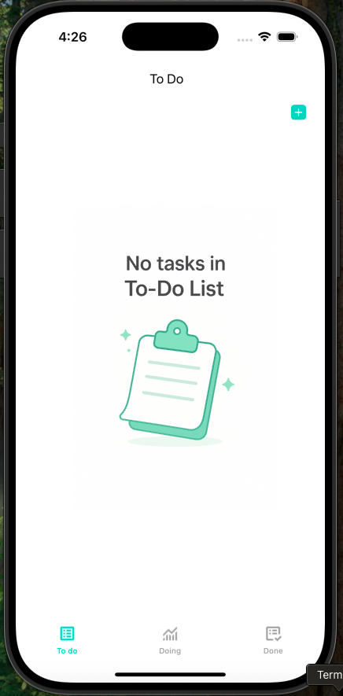
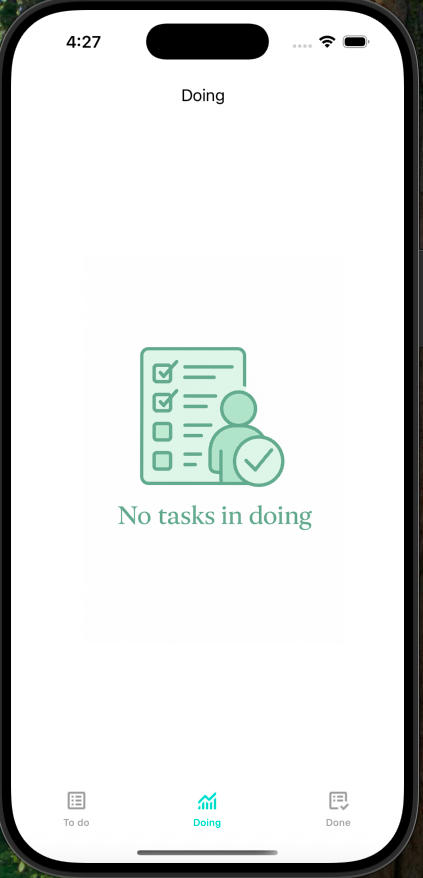
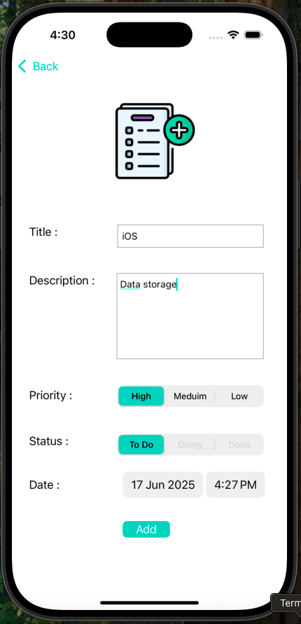
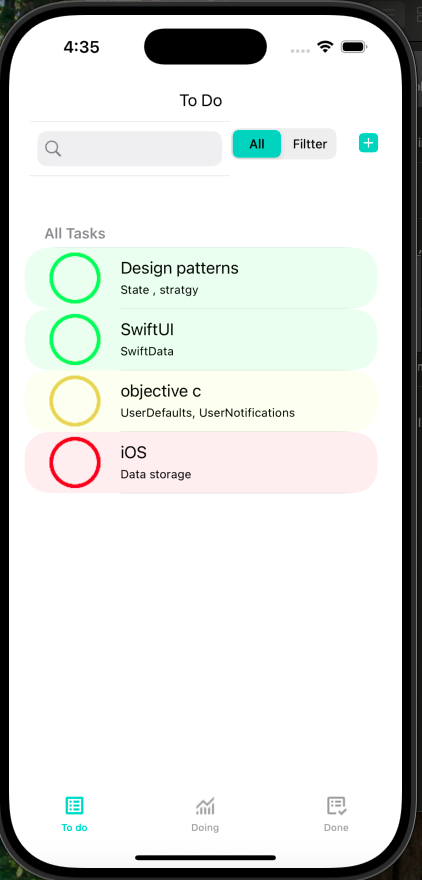
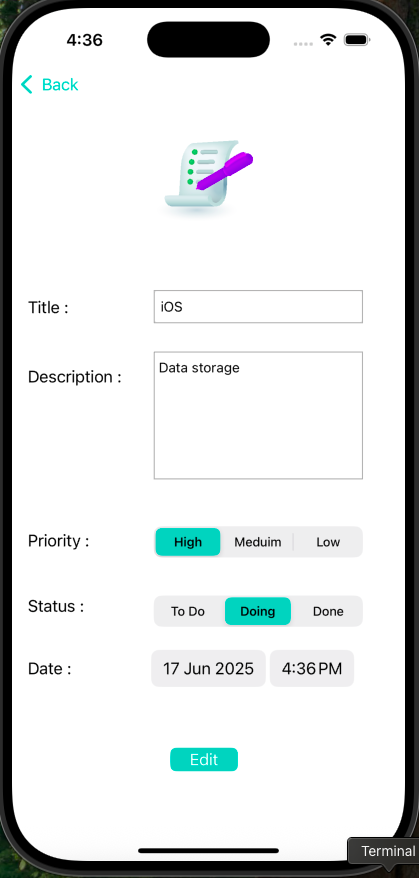
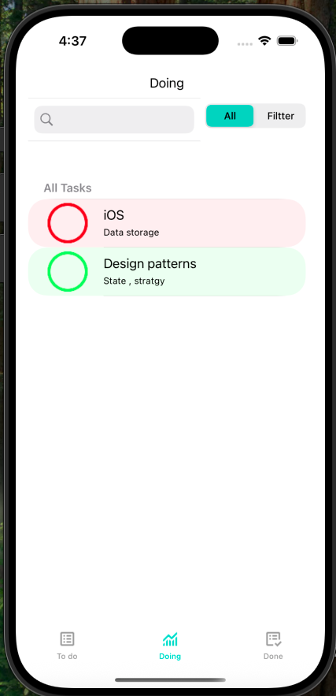
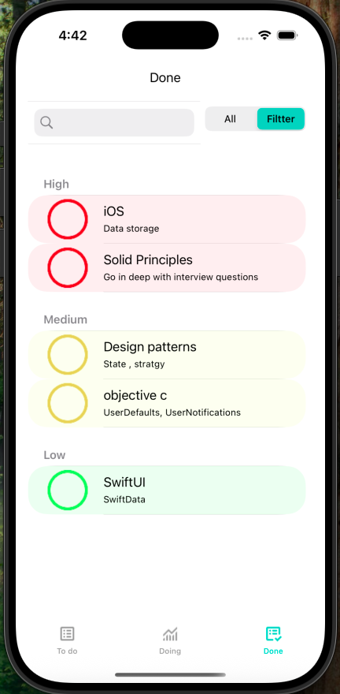
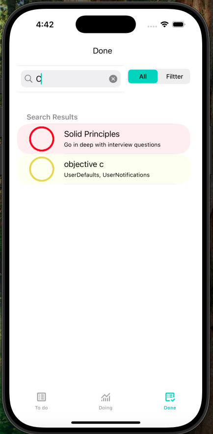

📝 Tasky – Simple To-Do App for iOS

Tasky is a basic and clean task manager app built using Objective-C and UIKit. It helps you organize your daily tasks, set priorities, track progress, and get reminders — all saved locally on your device.

---

Features

➕ Add Task
- Add a task with name, description, and priority (High, Medium, Low)
- Automatically saves the creation date
- Visual icons for each priority level
- Set a reminder

View Tasks
- See all your tasks in a simple list
- Tap to view task details

Edit Tasks
- Modify any task’s name, description, or priority

 Delete Tasks
- Remove tasks easily with a swipe

Task Status
- Mark as:
  - To-Do
  - In Progress (can’t go back)
  - Done (final state)

Search & Filter
- Search tasks by name
- Filter by:
  - Status (To-Do, In Progress, Done)
  - Priority (High, Medium, Low)

Local Storage
- Tasks saved using `NSUserDefaults`
- No internet required

---

Built With

- Objective-C
- UIKit
- NSUserDefaults
- UserNotifications (for reminders)
---

📸 Screenshots
| Empty ToDo | Empty Doing  | Add Task |
|------|----------|----------|
|  |  |  |

| ToDo Tasks | Edit Task | Doing |
|-------------|-----------|--------|
|  |  |  |

|  Filter | Search |
|--------|--------|
|  |  |

